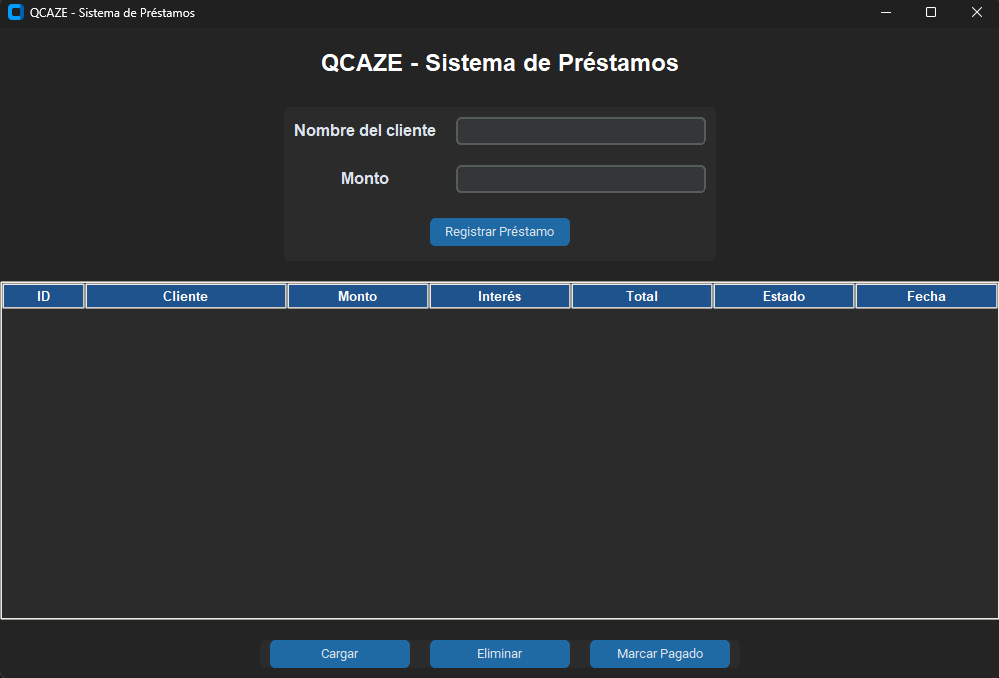

# 愛 QCAZE - Sistema de Gestión de Préstamos



Sistema desarrollado en Python y Supabase para la gestión de préstamos.

## Descripción

QCAZE es un sistema desarrollado en Python para la gestión de préstamos personales. El software permite registrar clientes, calcular automáticamente el interés quincenal, almacenar la información en una base de datos Supabase y administrar el estado de cada préstamo.

Este proyecto fue desarrollado como una solución para agilizar el control de préstamos realizados manualmente, reduciendo errores y mejorando la organización de la información.

---

## Problema Identificado

Actualmente muchos prestamistas pequeños realizan el seguimiento de sus préstamos de forma manual, utilizando cuadernos o registros físicos.

Esto genera inconvenientes como:

* Pérdida de información.
* Dificultad para calcular intereses.
* Lentitud al consultar clientes.
* Problemas para controlar pagos realizados.
* Mayor riesgo de errores humanos.

QCAZE busca automatizar este proceso mediante una aplicación sencilla y fácil de utilizar.

---

## Objetivo General

Desarrollar un sistema de gestión de préstamos que permita registrar clientes, calcular intereses automáticamente y almacenar la información en una base de datos para facilitar el control financiero.

---

## 經 Tecnologías Utilizadas

### Lenguaje de Programación

* Python 3.12

### Base de Datos

* Supabase
* PostgreSQL

### Librerías

#### CustomTkinter

Utilizada para el diseño de la interfaz gráfica.

Instalación:

```bash
pip install customtkinter
```

#### Supabase

Utilizada para conectar Python con la base de datos.

Instalación:

```bash
pip install supabase
```

#### Tkinter

Utilizada para la tabla de visualización de datos (Treeview).

---

## 經 Estructura del Proyecto

```text
📁QCAZE/
│
├── main.py
├── funciones.py
├── conexion.py
├── config.py
└── README.md
```

### main.py

Contiene la interfaz gráfica y la interacción con el usuario.

### funciones.py

Contiene las funciones relacionadas con la lógica del sistema:

* Registrar préstamos.
* Consultar préstamos.
* Eliminar préstamos.
* Marcar préstamos como pagados.

### conexion.py

Establece la conexión con Supabase.

### config.py

Almacena la URL y la KEY del proyecto Supabase.

---

## 這Base de Datos

Tabla utilizada:

### Prestamos

Campos:

| Campo          | Tipo   |
| -------------- | ------ |
| id             | bigint |
| nombre_cliente | text   |
| monto          | bigint |
| interes        | bigint |
| total_pagar    | bigint |
| fecha_prestamo | date   |
| estado         | text   |

---

## Funcionalidades Implementadas

### Registrar Préstamo

Permite ingresar:

* Nombre del cliente.
* Monto prestado.

El sistema calcula automáticamente:

* Interés quincenal del 5%.
* Total a pagar.

---

### 工程Visualizar Préstamos

Muestra en una tabla:

* ID.
* Cliente.
* Monto.
* Interés.
* Total.
* Estado.
* Fecha.

---

### Eliminar Préstamo

Permite eliminar registros seleccionados.

---

### Marcar como Pagado

Permite cambiar el estado de un préstamo de:

```text
Activo
```

a

```text
Pagado
```

---

## Fórmula Utilizada

Interés quincenal:

Interés = Monto × 5%

Ejemplo:

Monto: $100.000

Interés: $5.000

Total a pagar: $105.000

---

## Posibles Mejoras Futuras

* Configurar porcentaje de interés desde la interfaz.
* Aplicar mora automática.
* Historial de pagos.
* Reportes PDF.
* Dashboard financiero.
* Búsqueda de clientes.
* Estadísticas de préstamos.

---

## Autor

Proyecto desarrollado por Rodolfo Manga y Justin Myrs.

Año: 2026.
